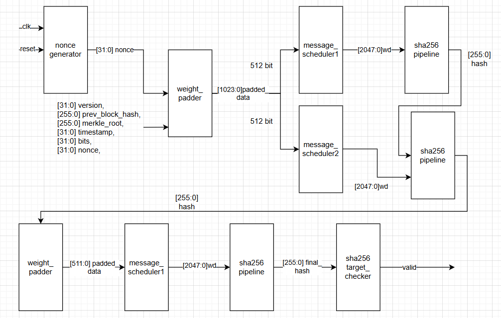

# 🪙 Bitcoin Mining Algorithm (SHA-256) in Verilog

A **hardware implementation of the Bitcoin mining pipeline** written entirely in **Verilog HDL**, including a fully functional **SHA-256 hashing core** and a **mining control pipeline**.  
The design is compatible with **ASIC/FPGA** simulation and demonstrates the **Bitcoin proof-of-work (PoW)** process at the hardware level.

---

## Structure

## Features

- **Fully verified SHA-256 algorithm**  
  Implemented and tested using testbench verification.

- **Double SHA-256 hashing pipeline**  
  Follows the Bitcoin block header hashing procedure.

- **Bitcoin mining pipeline simulation**  
  The target hash dynamically changes on every positive clock edge to emulate mining behavior.

- **Modular design structure**  
  Easy to extend and integrate with real FPGA or ASIC architectures.

- **Waveform verification**  
  Verified using Vivado simulator with consistent timing and hash correctness.

---

##  Project Overview

This project demonstrates how the **Bitcoin mining algorithm** works at the **hardware architecture level** — from block header construction to double SHA-256 hashing and nonce iteration.

**Modules include:**
- `nonce_generator.v` – generate nonce for data, following the posedge clock
- `weight_padder.v` – combine data to generate 512 or 1024 bit to prepare for SHA256 algorithm
- `message_scheduler.v` – prepare the Wi for SHA256 algoritm
- `sha256_round.v` – Compute a round of SHA256, pos
- `sha256_pipeline.v` – Consist of 64 module of `sha256_round.v`
- `sha256_target_checker` – Check the hash with the target  
- `bitcoin_mining_asic.v` – Top-level mining pipeline combine all modules  

---

##  Simulation Results

###  SHA-256 Testbench

Successfully verified the correctness of SHA-256 hashing algorithm.  
Example simulation result:

---

###  Bitcoin Mining Pipeline Testbench

Successfully tested the Bitcoin mining pipeline.  
The **target hash** changes dynamically following the **posedge clock**:

